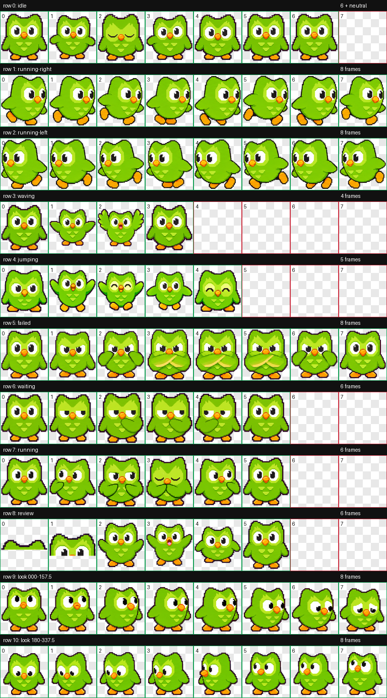
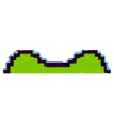

# Duo Plus for Codex

An unofficial, fan-made Codex pet featuring Duo with livelier reactions, expressive directional movement, and a complete v2 animation spritesheet.



## Highlights

- Vivid state-based animations
- 16 directional looking poses
- Transparent-background sprites
- Codex pet format v2
- Complete source frames, prompts, references, and QA results
- Ready-to-install package for Windows

## Custom reactions

| State | Animation |
|---|---|
| Failed | Duo angrily crosses its wings |
| Waiting | Duo puts a wing beneath its chin and looks impatient |
| Waving | Duo enthusiastically flaps both wings |
| Finished | Duo pops up from below as a cheerful surprise |

## Animation previews

### Failed


### Waiting


### Waving


### Finished successfully



## Installation

1. Download or clone this repository.
2. Extract [`package/Duo-Plus.codex-pet.zip`](package/Duo-Plus.codex-pet.zip).
3. Place the extracted files in:

   ```text
   %USERPROFILE%\.codex\pets\duo-plus
   ```

4. The installed directory should contain:

   ```text
   duo-plus/
   ├── pet.json
   └── spritesheet.webp
   ```

5. Restart Codex if it is already running.
6. Open the pet selector and choose **Duo Plus**.

## Repository structure

```text
├── decoded/          Generated animation-row artwork
├── final/            Final standard and v2 spritesheets
├── frames/           Individual animation frames
├── package/          Ready-to-install Duo Plus package
├── prompts/          Image-generation prompts and revisions
├── qa/               Contact sheets, previews, and validation results
├── references/       Character and layout references
├── selected poses/   Original pose selections
├── imagegen-jobs.json
└── pet_request.json
```

## Technical details

- Pet ID: `duo-plus`
- Display name: `Duo Plus`
- Sprite format: WebP with transparency
- Sprite version: `2`
- Atlas layout: 8 columns × 11 rows
- Atlas dimensions: 1536 × 2288 pixels
- Validation status: passed

The first nine rows contain the standard Codex pet animation states. The final two rows provide the 16-direction look system required by the v2 format.

## Development and QA

The repository includes the complete creation workflow:

- Selected pose references
- Motion blueprints
- Image-generation prompts
- Extracted animation frames
- Animated GIF previews
- Directional continuity checks
- Chroma-spill validation
- Final visual QA reports
- Package and installed-atlas validation

See [`qa/run-summary.json`](qa/run-summary.json) and [`qa/final-visual-qa.json`](qa/final-visual-qa.json) for the final results.

## Disclaimer

This is an unofficial fan project created for personal customization of Codex. It is not affiliated with, endorsed by, or sponsored by Duolingo or OpenAI. Duo and related character assets belong to their respective rights holders.
